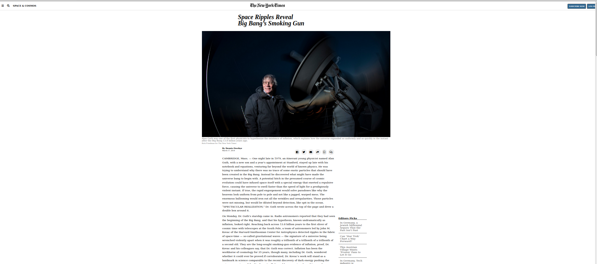

# New_York_Times_article_page_clone
> Project based on a clone of the New_York_Times_artice_page

You can find the original project specification at: https://www.theodinproject.com/courses/html5-and-css3/lessons/positioning-and-floating-elements

## Built With

- CSS and HTML
- Float
- Box Model

## Live Demo

[Live Demo Link](https://rawcdn.githack.com/Elbie-em/New_York_Times_article_page_clone/b7bf7d6ddf8a7a91f32cb6cc1b5e062dba547290/index.html)

## Getting Started

**This is a static page and was made using  CSS & HTML, you don't need .**
**anything to start up this page, is already published in a public repository so you can check the final result. For a better understanding of the code read about FlexBox.**

## Authors

👤 **Xóchitl Selene Flores Pérez**

- Github: [@enelesmai](https://github.com/enelesmai)
- Twitter: [@enelesmai](https://twitter.com/enelesmai)
- Linkedin: [xochitlselene](https://linkedin.com/in/xochitlselene)

👤 **Elbie Moonga**

- GitHub: [@Elbie-Em] (https://github.com/Elbie-em)
- Twitter: [ElbieEm] (https://twitter.com/ElbieEm)
- LinkedIn: [elbie-moonga] (https://www.linkedin.com/in/elbie-moonga-253bbb12b/)

## 🤝 Contributing

Contributions, issues and feature requests are welcome!

Feel free to check the (https://github.com/Elbie-em/New_York_Times_article_page_clone/issues).

## Show your support

Give a ⭐️ if you like this project!

## 📝 License

This project is [MIT](lic.url) licensed.
